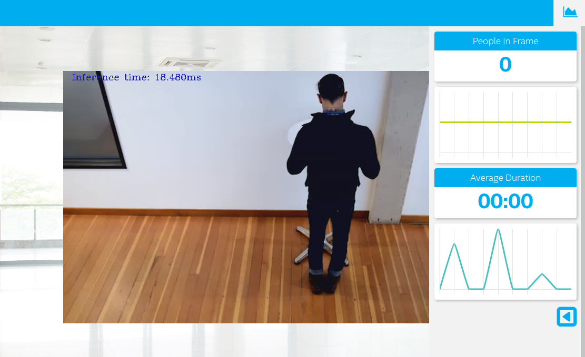

# Project Write-Up

## Explaining Custom Layers

In this repository, the mode SSD, Single Shot Multibox Detector, is used.
SSD is an object detection approach used in real-time streaming video.
In this detection appraoch, the detector can find the locations of several different types of objects.

There are many variations of SSD, and here MobileNet V2 as the backbone and SSDLite, which employs depthwise separable convolutions for the SSD layers, is used.

First as an existing model, down load ssdlite_mobilenet_v2_coco from http://download.tensorflow.org/models/object_detection/ssdlite_mobilenet_v2_coco_2018_05_09.tar.gz.

To be able to run with Intel OpenVINO, we need to obtaine an intermediate representation of the downloaded model.
Extract the downloaded file, and run the following command in the extracted folder, where the fronzen_inference_graph.pb exist.
This is a tensor flow generated model with floating point 32 precision.
Considering to run on Raspberry Pi, where floating point 16 precision is needed, generated the intermediate representation (IR) with `--data_type FP16` option.

```
$ python /opt/intel/openvino/deployment_tools/model_optimizer/mo.py --input_model frozen_inference_graph.pb  --data_type FP16 --tensorflow_object_detection_api_pipeline_config pipeline.config --reverse_input_channels --transformations_config /opt/intel/openvino/deployment_tools/model_optimizer/extensions/front/tf/ssd_v2_support.json
Model Optimizer arguments:
Common parameters:
    - Path to the Input Model:  /home/hajime/Downloads/ssdlite_mobilenet_v2_coco_2018_05_09/frozen_inference_graph.pb
    - Path for generated IR:    /home/hajime/Downloads/ssdlite_mobilenet_v2_coco_2018_05_09/.
    - IR output name:   frozen_inference_graph
    - Log level:    ERROR
    - Batch:    Not specified, inherited from the model
    - Input layers:     Not specified, inherited from the model
    - Output layers:    Not specified, inherited from the model
    - Input shapes:     Not specified, inherited from the model
    - Mean values:  Not specified
    - Scale values:     Not specified
    - Scale factor:     Not specified
    - Precision of IR:  FP16
    - Enable fusing:    True
    - Enable grouped convolutions fusing:   True
    - Move mean values to preprocess section:   False
    - Reverse input channels:   True
TensorFlow specific parameters:
    - Input model in text protobuf format:  False
    - Path to model dump for TensorBoard:   None
    - List of shared libraries with TensorFlow custom layers implementation:    None
    - Update the configuration file with input/output node names:   None
    - Use configuration file used to generate the model with Object Detection API:  /home/hajime/Downloads/ssdlite_mobilenet_v2_coco_2018_05_09/pipeline.config
    - Use the config file:  None
Model Optimizer version:    2020.2.0-60-g0bc66e26ff
[ WARNING ]  
Detected not satisfied dependencies:
    tensorflow: installed: 2.1.0, required: < 2.0.0

Please install required versions of components or use install_prerequisites script
/opt/intel/openvino_2020.2.120/deployment_tools/model_optimizer/install_prerequisites/install_prerequisites_tf.sh
Note that install_prerequisites scripts may install additional components.
The Preprocessor block has been removed. Only nodes performing mean value subtraction and scaling (if applicable) are kept.

[ SUCCESS ] Generated IR version 10 model.
[ SUCCESS ] XML file: /home/hajime/Downloads/ssdlite_mobilenet_v2_coco_2018_05_09/./frozen_inference_graph.xml
[ SUCCESS ] BIN file: /home/hajime/Downloads/ssdlite_mobilenet_v2_coco_2018_05_09/./frozen_inference_graph.bin
[ SUCCESS ] Total execution time: 30.14 seconds. 
[ SUCCESS ] Memory consumed: 473 MB.
```

As a model
frozen_inference_graph.xml
and as weights
frozen_inference_graph.bin
are generated.

These models are copied to `model` folder in the repository.

## Comparing Model Performance

Accuracy of the model will decreased as here FP32 to FP16 conversion is selected, so that it could be run on Raspberry Pi.
But the model size is shrinked from TnsorFlow 19.9MB to OpenVino 9.3MB.

## Demo

Following is the demo video.
If you cannot see it in your browser, please directly open video/ui.mp4 in this repository

<video src="video/ui.mp4" controls>video/ui.mp4</video>


## Assess Model Use Cases

Object detection and counter is helpful, as it helps avoid storing video stream itself in the IoT Platform.
Instead, meaningful data, in this case people count and duration, is uploaded and stored.
In most cases, storage is the cost part in the IoT use cases, and it is good if we can store only meaningful data in the storage.
IoT platform DB is not designed to store large blob data, rather than optimized to store scalar data.

Edge AI is expected in this area to mitigate data trasmission and storage costs.

## Assess Effects on End User Needs

This person is not detected when he stands still. Could be this person wears the black clothes.

Could work if the background is removed and properly color scales are changed.

