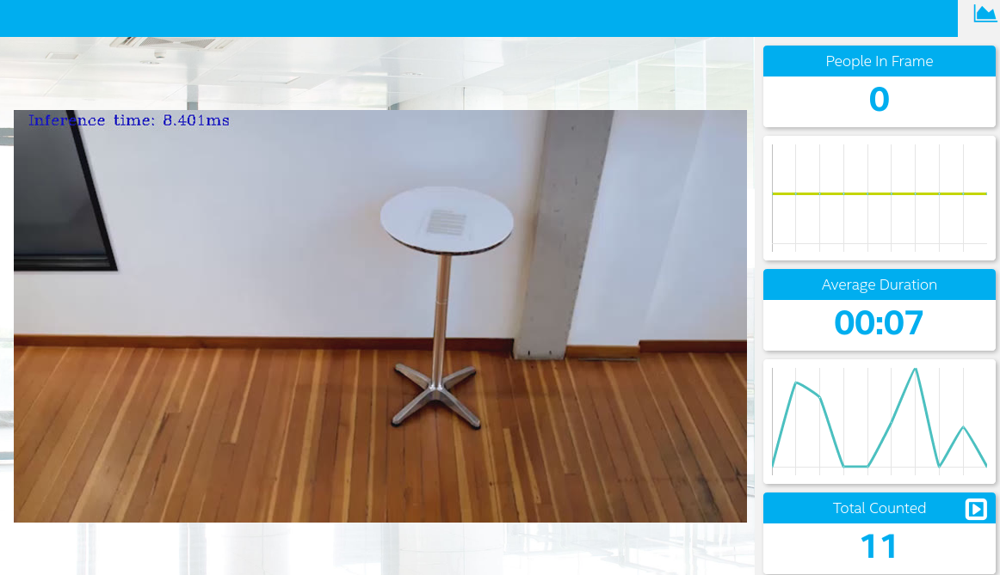

# Project Write-Up

## Explaining Custom Layers

In this repository, the mode SSD, Single Shot Multibox Detector, is used.
SSD is an object detection approach used in real-time streaming video.
In this detection appraoch, the detector can find the locations of several different types of objects.

There are many variations of SSD, and here MobileNet V2 as the backbone and SSDLite, which employs depthwise separable convolutions for the SSD layers, is used.

First as an existing model, down load ssdlite_mobilenet_v2_coco from http://download.tensorflow.org/models/object_detection/ssdlite_mobilenet_v2_coco_2018_05_09.tar.gz.

To be able to run with Intel OpenVINO, we need to obtaine an intermediate representation of the downloaded model.
Extract the downloaded file, and run the following command in the extracted folder, where the fronzen_inference_graph.pb exist.
This is a tensor flow generated model with floating point 32 precision.
Considering to run on Raspberry Pi, where floating point 16 precision is needed, generated the intermediate representation (IR) with `--data_type FP16` option.

```
$ python /opt/intel/openvino/deployment_tools/model_optimizer/mo.py --input_model frozen_inference_graph.pb  --data_type FP16 --tensorflow_object_detection_api_pipeline_config pipeline.config --reverse_input_channels --transformations_config /opt/intel/openvino/deployment_tools/model_optimizer/extensions/front/tf/ssd_v2_support.json
Model Optimizer arguments:
Common parameters:
    - Path to the Input Model:  /home/hajime/Downloads/ssdlite_mobilenet_v2_coco_2018_05_09/frozen_inference_graph.pb
    - Path for generated IR:    /home/hajime/Downloads/ssdlite_mobilenet_v2_coco_2018_05_09/.
    - IR output name:   frozen_inference_graph
    - Log level:    ERROR
    - Batch:    Not specified, inherited from the model
    - Input layers:     Not specified, inherited from the model
    - Output layers:    Not specified, inherited from the model
    - Input shapes:     Not specified, inherited from the model
    - Mean values:  Not specified
    - Scale values:     Not specified
    - Scale factor:     Not specified
    - Precision of IR:  FP16
    - Enable fusing:    True
    - Enable grouped convolutions fusing:   True
    - Move mean values to preprocess section:   False
    - Reverse input channels:   True
TensorFlow specific parameters:
    - Input model in text protobuf format:  False
    - Path to model dump for TensorBoard:   None
    - List of shared libraries with TensorFlow custom layers implementation:    None
    - Update the configuration file with input/output node names:   None
    - Use configuration file used to generate the model with Object Detection API:  /home/hajime/Downloads/ssdlite_mobilenet_v2_coco_2018_05_09/pipeline.config
    - Use the config file:  None
Model Optimizer version:    2020.2.0-60-g0bc66e26ff
[ WARNING ]  
Detected not satisfied dependencies:
    tensorflow: installed: 2.1.0, required: < 2.0.0

Please install required versions of components or use install_prerequisites script
/opt/intel/openvino_2020.2.120/deployment_tools/model_optimizer/install_prerequisites/install_prerequisites_tf.sh
Note that install_prerequisites scripts may install additional components.
The Preprocessor block has been removed. Only nodes performing mean value subtraction and scaling (if applicable) are kept.

[ SUCCESS ] Generated IR version 10 model.
[ SUCCESS ] XML file: /home/hajime/Downloads/ssdlite_mobilenet_v2_coco_2018_05_09/./frozen_inference_graph.xml
[ SUCCESS ] BIN file: /home/hajime/Downloads/ssdlite_mobilenet_v2_coco_2018_05_09/./frozen_inference_graph.bin
[ SUCCESS ] Total execution time: 30.14 seconds. 
[ SUCCESS ] Memory consumed: 473 MB.
```

As a model
frozen_inference_graph.xml
and as weights
frozen_inference_graph.bin
are generated.

These models are copied to `model` folder in the repository.

## Execute

Running environment
```
Architecture:        x86_64
CPU op-mode(s):      32-bit, 64-bit
Byte Order:          Little Endian
CPU(s):              12
On-line CPU(s) list: 0-11
Thread(s) per core:  2
Core(s) per socket:  6
Socket(s):           1
NUMA node(s):        1
Vendor ID:           GenuineIntel
CPU family:          6
Model:               158
Model name:          Intel(R) Core(TM) i7-8750H CPU @ 2.20GHz
Stepping:            10
CPU MHz:             2891.211

```

### Step 1 - Start the Mosca server

```
cd webservice/server/node-server
node ./server.js
```

You should see the following message, if successful:
```
Mosca server started.
```

### Step 2 - Start the GUI

Open new terminal and run below commands.
```
cd webservice/ui
npm run dev
```

You should see the following message in the terminal.
```
webpack: Compiled successfully
```

### Step 3 - FFmpeg Server

Open new terminal and run the below commands.
```
sudo ffserver -f ./ffmpeg/server.conf
```

### Step 4 - Run the code

Open new terminal and run the below commands.
```
$ python main.py -i resources/Pedestrian_Detect_2_1_1.mp4 -m ./model/frozen_inference_graph.xml -d CPU -pt 0.1 | ffmpeg -v warning -f rawvideo -pixel_format bgr24 -video_size 768x432 -framerate 24 -i - http://0.0.0.0:3004/fac.ffm
/home/hajime/anaconda3/lib/python3.7/importlib/_bootstrap.py:219: RuntimeWarning: compiletime version 3.6 of module 'openvino.inference_engine.ie_api' does not match runtime version 3.7
```

## Comparing Model Performance

Accuracy of the model will decreased as here FP32 to FP16 conversion is selected, so that it could be run on Raspberry Pi.
But the model size is shrinked from TnsorFlow 19.9MB to OpenVino 9.3MB.

#### Running inference on CPU

```
count  1394.000000
mean     14.860009
std       5.434970
min       6.984472
25%       9.946406
50%      13.394356
75%      20.350635
max      35.712481
```

#### Running inference on GPU

When run on GPU with `-d GPU` option, the perfomce became worse.
Mean inference time is 32.0 msec.

```
count  1394.000000
mean     29.883362
std       9.340245
min      16.871214
25%      22.423744
50%      25.508761
75%      39.971769
max      45.503616
```

#### Intel Neural Compute Stick2

When run on GPU with `-d MYRIAD` option, the perfomce is below.
Mean inference time is 63.13 msec.
What is interesting is std is 0.93 msec. There are little variance in inference time.

```
count  1394.000000
mean     63.134159
std       0.930729
min      60.528994
25%      62.531292
50%      62.997341
75%      63.622832
max      67.390680
```

## Demo

Following is the demo video.
If you cannot see it in your browser, please directly open video/ui.mp4 in this repository

<video src="video/ui.mp4" controls>video/ui.mp4</video>

Finally, 5 people are detected (Avarage Duration 15 sec).


## Assess Model Use Cases

We have recently (2020/06) opening office after lockdown by COVID-16.
To open office, we are requested to track number of people in the office.
Without recording the video in the edge devices or server, we can only record the number of people with this model.

This will provide solution for this request with this model.

Object detection and counter is helpful, as it helps avoid storing video stream itself in the IoT Platform.
Instead, meaningful data, in this case people count and duration, is uploaded and stored.
In most cases, storage is the cost part in the IoT use cases, and it is good if we can store only meaningful data in the storage.
IoT platform DB is not designed to store large blob data, rather than optimized to store scalar data.

Edge AI is expected in this area to mitigate data trasmission and storage costs.

## Assess Effects on End User Needs

This person is not detected when he stands still.

Could work if the background is removed and properly color scales are changed.

### Preprocessin the image

INPUT source (images) quality might help improve detection.
Lighting could change the brightness or hue of the images.
Focal length could make images blurry.
Small image size means low resolution, and it will affect model ability to detect small objects.

Here to work with lighting condition, contrast sharpened by image process in OpenCV.

Tried to reprocess the image to be a higher contrast image with the following code snippet.
The brightness is adjusted.
```
    hsv = cv2.cvtColor(img, cv2.COLOR_RGB2HSV)
    h, s, b = cv2.split(hsv)
    b = cv2.equalizeHist(b)
    hsv = cv2.merge((h,s,b))
    img = cv2.cvtColor(img, cv2.COLOR_HSV2RGB)
```
But this did not increase the detection performance in this case.

### Detection Precision from 0.6 to 0.1 - effective

When running with `-pt 0.1`, the person starts getting detected.
This improves the total peopler count, as even for other people, dropping from detection is decreased.
So the time when not counted is increased.

### Improvement

This would be a image processing technique, but when the diff between the consequtive frames is small enough,
we can keep the detection result from the previous frames.
Instead of infering, total number of people could be improved by this.

## Other model

### NVIDIA SSD

This is the pretrained model with PyTorch, provided in  https://pytorch.org/hub/nvidia_deeplearningexamples_ssd/.
Trained with COCO dataset, and used SSD with ResNet-50 as a backbone.
The model was once converted to ONNX model and then to IR to run with ONNX.

#### Set up envirohment.

PyTorch environment is created on top-of anaconda environment.
```
$  conda create -n pytorch python=3.7 anaconda
$  conda activate pytorch
$  conda install pytorch torchvision cudatoolkit=10.2 -c pytorch
$  conda install -c conda-forge onnx
```

#### Model Conversion
In this environment run the following python script.
```
import torch

precision = 'fp32'
ssd_model = torch.hub.load('NVIDIA/DeepLearningExamples:torchhub', 'nvidia_ssd', model_math=precision)

dummy_input = torch.randn(10, 3, 300, 300, device='cpu')

# Providing input and output names sets the display names for values
# within the model's graph. Setting these does not change the semantics
# of the graph; it is only for readabilitya
#
# The inputs to the network consist of the flat list of inputs (i.e.
# the values you would pass to the forward() method) followed by the
# flat list of parameters. You can partially specify names, i.e. provide
# a list here shorter than the number of inputs to the model, and we will
# only set that subset of names, starting from the beginning.
input_names = [ "actual_input_1" ] + [ "learned_%d" % i for i in range(16) ]
output_names = [ "output1" ]

torch.onnx.export(ssd_model, dummy_input, "nvidia_ssd.onnx", verbose=True, input_names=input_names, output_names=output_names)
```
This will create a ONNX representation of the NVIDIA SSD model, nvidia_ssd.onnx.
To convert ONNX model to IR for OpenVINO, run the following script.
```
python /opt/intel/openvino_2020.2.120/deployment_tools/model_optimizer/mo.py --input_model nvidia_ssd.onnx --data_type FP16
-input_model nvidia_ssd.onnx --data_type FP16
```
I have run with FP16 option to be executable with OpenVINO on Raspberry Pi.


#### Run the model
To evaluate this model performance, run the following command.
```
python main_othermodel.py -i resources/Pedestrian_Detect_2_1_1.mp4 -m ./model/nvidia_ssd.xml -d CPU -pt 0.1 | ffmpeg -v warning -f rawvideo -pixel_format bgr24 -video_size 768x432 -framerate 24 -i - http://0.0.0.0:3004/fac.ffm
```

Following is the execution time perfomrance.
```
count  1394.000000
mean    122.872293
std      27.871472
min      81.460953
25%      96.125364
50%     122.553945
75%     150.165439
max     230.868101
```
(Detection is not evaluated, as the output is not clearly described in the document, and I could not extract the detected objects out of it.)

#### Conclusion

This model is not selected, as it cannot achieve the real-time capability with my PC environment.
As you can find in the mean value, the average inference time is 122.87 msec, and this is slower in compared to the video frame rate(24fps).

It might work with higer performance CPUs or NVIDIA GPU with original model.

### ssd_mobilenet_v2_coco_2018_03_29

Downloaded from 
http://download.tensorflow.org/models/object_detection/ssd_mobilenet_v2_coco_2018_03_29.tar.gz

Extracted the downloaded file, and under the foloder extracted, run the below command to get IR model.
```
python /opt/intel/openvino/deployment_tools/model_optimizer/mo.py --input_model frozen_inference_graph.pb  --data_type FP16 --tensorflow_object_detection_api_pipeline_config pipeline.config --reverse_input_channels --transformations_config /opt/intel/openvino/deployment_tools/model_optimizer/extensions/front/tf/ssd_v2_support.json
```

Performance
```
count  1393.000000
mean     23.212881
std       8.917362
min      12.145996
25%      15.252829
50%      20.102978
75%      32.195807
max      47.665596
```


#### Conclusion

This model is not selected.
Total number of people detected was 5. But the duration was worse, 12 sec, as more jitters while detecting the 3rd person.
Inference time is a little longer than one employed this time.

### person-detection-retail-0013

Intel provides pretrained models. This is used as a reference.
I have used a model below.
https://docs.openvinotoolkit.org/latest/_models_intel_person_detection_retail_0013_description_person_detection_retail_0013.html

The executable repository is provided 
https://github.com/intel-iot-devkit/people-counter-python

Performance in inference time and detection is better than the one I have downloaded.
```
count  1394.000000
mean     16.608900
std       7.336377
min       7.537842
25%       9.477377
50%      14.140725
75%      23.314655
max      40.088177
```

The perfomrance of this model is better as it reduced the amount of computation in its model eplanation.
Also my selected model is leaned from COCO 2017 model. It is intended to train multiple types of objects (like chairs, toothbrushes, and etc.).
Might the accuracy be improved by trainning with moder peson images.

